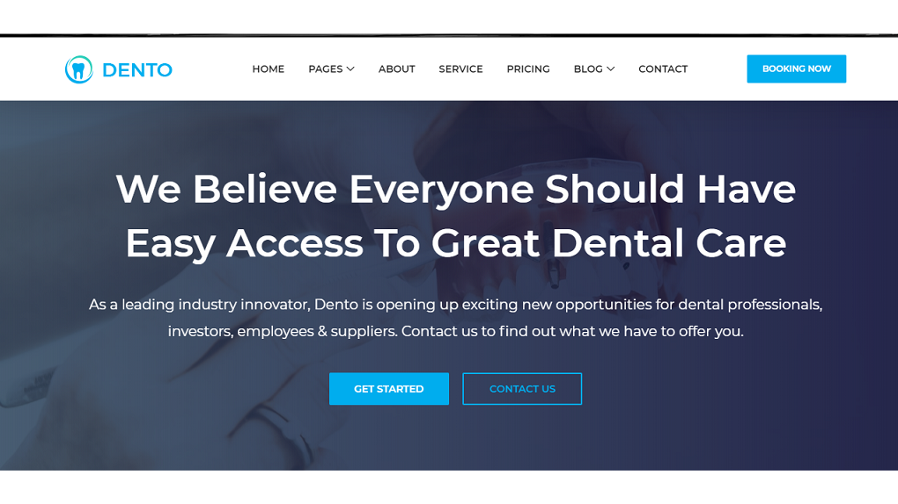

# dental_website_django
A fully responsive website idle for any small town dentist.

website has enabled with contact form, receiving and autoreply through email,with seven <navbar>
I am using heroku app for hosting the website. Reference link has updated below. 
Please add your suggestions or improvement if needed.
refrenece link- https://tamaldentalwebapp.herokuapp.com/

command terminal used= "git-bash-terminal"
text editor user="sublime-text editor "

